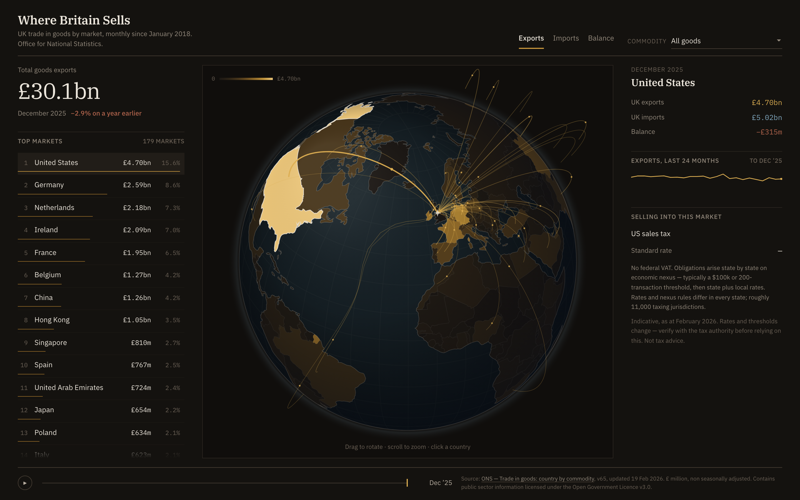

# Where Britain Sells

Every pound of UK goods trade, by country and by month, on one screen.

**→ [uk-trade-globe.vercel.app](https://uk-trade-globe.vercel.app)**



Live data from the [ONS "Trade in goods: country by commodity" API][api]: **236 countries and
territories × 96 months × 123 commodity classes**, in £ millions. Drag the globe, scrub eight
years of history, or press play and watch the flows redistribute through Brexit and Covid in
about ten seconds.

(217 of those territories have recorded trade at some point in the window and are kept in the
bundle; a typical single month has trade with about 180.)

The layer that makes it more than a map: each market carries its **indirect-tax regime** —
whether one EU OSS registration covers it, whether you need a standalone VAT registration,
or whether (hello, United States) there is no federal VAT at all and obligations arise state
by state on economic nexus. "£4.7bn went here last month" and "here is what selling here
actually involves" belong on the same screen.

## Run it

```bash
npm install && npm run dev
```

The data bundle is committed, so it runs offline. To rebuild it from the live API:

```bash
npm run fetch
```

Every response is cached under `.cache/`, so reruns are near-free. `npm run fetch -- --refresh`
ignores the cache.

## Check it

```bash
npm run check
```

This is the part I care most about. The ONS publishes a `W1 — Whole world` row alongside the
per-country rows, which makes the dataset self-checking: sum the countries, compare to ONS's
own total. Across every month and both directions — **192 totals** — it reconciles exactly,
not approximately.

The suite also asserts that the 10 SITC sections sum to the all-commodity total, that the
96-month series has no gaps or ordering faults, that no aggregate row (`W1`/`B5`/`D5`) has
leaked into the country series, and — the check that guards the ugliest silent failure — that
the ISO alpha-2 → numeric join lands on the right polygons. An off-by-one there would shade
Greenland with the United States' trade and nothing else would complain.

```
Reconciliation vs ONS "W1 — Whole world"
  ✓ 192 month × direction totals reconcile exactly against ONS's own world row
Country code coverage
  ✓ all 217 trading partners either map to a polygon or are declared polygon-less
Country join
  ✓ all 20 spot-checked ISO codes resolve to the right polygon
```

## How it fits together

| | |
|---|---|
| `scripts/fetch-ons.mjs` | Pulls the API, caches every response, bakes `src/data/trade.json` (277 KB) |
| `scripts/reconcile.mjs` | The checks above |
| `scripts/iso.mjs` | ISO alpha-2 → numeric-3, plus the explicit list of polygon-less partners |
| `src/globe/Globe.js` | Orthographic canvas globe: choropleth, great-circle arcs, flow particles, hit-testing |
| `src/globe/worldModel.js` | TopoJSON → features, centroids, borders, point-in-country lookup |
| `src/data/markets.js` | Indirect-tax regime per market |
| `src/main.js` | State, panels, scrubber |

No framework. `d3-geo` for the projection, `topojson-client` for the atlas, Vite to bundle.
440 KB of JavaScript, 153 KB gzipped, most of which is the data itself.

### Design

The brief was an instrument from a statistics office, not a dashboard from a startup. In
practice that meant deleting things: the neon-on-navy palette, the bloom on the arcs, the
star field, the floating rounded cards, the wide-tracked uppercase labels on every heading,
and the pulse on the selected country.

What replaced them:

- **Warm ink, not navy-black.** A ten-step neutral ramp whose hue rotates as it lightens,
  so a dark UI doesn't go muddy grey. Two pigments — ochre for exports, slate blue for
  imports — desaturated until they read as printing inks rather than LEDs.
- **IBM Plex**, all three cuts. Serif for the headline and the hero figure, Sans for the
  interface, Mono for every number. Self-hosted, so there's no third-party request and it
  works offline. The hero figure gets its authority from typeface and size, not from being
  painted an accent colour.
- **Rules and whitespace instead of cards.** There is exactly one bordered surface on the
  screen — the globe well — and it earns it by containing something that isn't text. Every
  section is introduced by a hairline with a small label sitting on it; that repeated motif
  is the layout's signature.
- **Tabular lining figures everywhere**, so columns align and digits don't jitter as the
  scrubber runs.
- **A surveyor's crosshair** marks the UK rather than a pulsing dot. It's a fixed reference
  point and should look like one.

### Two decisions worth explaining

**Choropleth uses a square-root scale on a single-hue ramp.** Trade value is violently
long-tailed — the US alone is 15.6% of exports. On a linear scale every market outside the
top five is indistinguishable from zero, which is exactly the information a market-entry
conversation needs. The ramp is one hue, dark to light: an earlier version ran slate → teal
→ gold, which is a rainbow, and on a magnitude scale hue changes carry no meaning while the
eye reads the jumps as category boundaries that aren't there.

**Playback advances on elapsed time, not one month per tick.** Timers and `requestAnimationFrame`
both get clamped when a tab isn't being painted — rAF stops dead, `setInterval` drops to about
1 Hz. A naive "one month per tick" turns a ten-second playthrough into several minutes. Deriving
the step count from elapsed wall-clock time keeps the run the same length either way.

## What this doesn't do

- **Commodity detail covers the latest month only.** The full commodity × country × month grid
  is ~2,000 API calls; the totals series is 192. The scrubber disables itself and says so when
  a commodity filter is active. Fetching the rest is a loop change, not a redesign.
- **Goods only.** The ONS publishes services trade separately and on a different geography
  basis. For the UK — a services-led economy — that is a real gap, and it is the first thing
  I would add.
- **The tax layer is indicative.** It covers 67 markets — 97% of UK two-way goods trade in the
  latest month, but only 28% of the territories on the globe — and it is dated. Rates move:
  four of the 27 EU standard rates changed between September 2024 and August 2025. It is
  signposted as needing verification against the tax authority, and it is not tax advice.
- **Non seasonally adjusted.** Month-on-month moves carry seasonality, which is why the headline
  compares year on year.

## Data and licence

Contains public sector information from the Office for National Statistics licensed under the
[Open Government Licence v3.0][ogl]. Dataset `trade`, edition `time-series`, version 65, ONS
last updated 19 February 2026. Values are £ million, non seasonally adjusted.

Country boundaries from [world-atlas][wa] (Natural Earth, public domain).

[api]: https://api.beta.ons.gov.uk/v1/datasets/trade
[ogl]: https://www.nationalarchives.gov.uk/doc/open-government-licence/version/3/
[wa]: https://github.com/topojson/world-atlas
